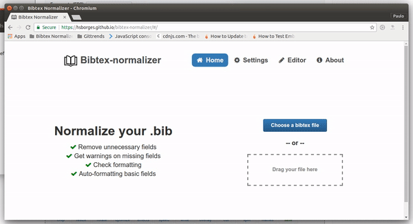
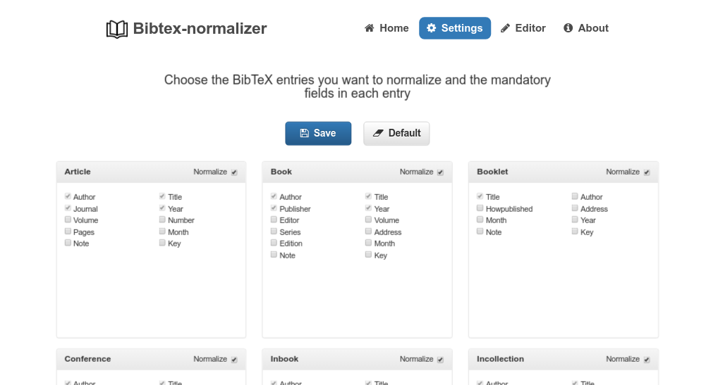

> Normalizing BibTeX entries to a common format

Bibtex-normalizer is an open source project to validate and normalize Bibtex entries online.
This tool uses a defined standard to organize your references in a single way, making it
easier to read.

## How it works

We normalize your references.bib in a simple way! If this is your first time here, you may need to follow these steps:

**Step 1**: access Bibtex-normalizer via https://hsborges.github.io/bibtex-normalizer/

**Step 2**: you can normalize your references by loading your file at "Home" tab or paste your content on "Editor" tab.

**Step 3**: after an automatic normalization process, Bibtex-normalizer lists all of potential issues regarding Bibtex standards. Those issues may be one of the following:

* unnecesary fields
* missing fields from Bibtex entries
* unformatted fields regarding Bibtex standards

**Step 4**: edit your file online to fix those issues and click on "Normalize".

**Step 5**: with your normalized file, you can copy to your clipboard or save as a new Bibtex file (.bib).

## Define your own configuration

Make adjustments on your normalization process accessing "Settings" tab, checking entries and attributes that your file needs to be normalized. Don't forget to Save your changes.

Configuration requires permission to use cookies.

## Developing

This project uses Ember.js as framework for web applications. More information about Ember.js, we suggest you to [check Ember website](https://www.emberjs.com/).
